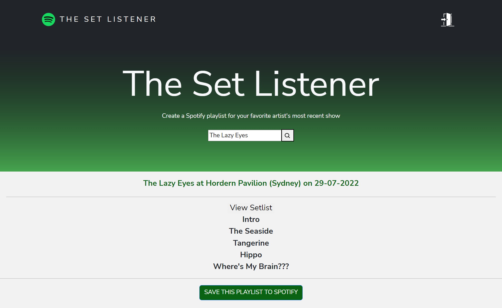

 

     

 

[The Set Listener](https://setlistener.herokuapp.com/) is a full-stack application built using React for the user interface, Nodejs as the backend JavaScript runtime environment, and Express.js as the backend framework. This application functions through the use of two separate API, [setlist.fm API](https://api.setlist.fm/docs/1.0/index.html) and [Spotify Web API](https://github.com/thelinmichael/spotify-web-api-node). 

Going to a show? Not totally familiar with an artist’s catalog? Give The Set Listener a try. The Set Listener is a web app that will create a Spotify playlist of an artist’s most recent show. To use The Set Listener just type in the artist name, and hit the search button, you’ll be presented with a playlist of songs from that artist’s most recent show.  Hit the ‘Save this playlist to Spotify’ button and you’ll have a Spotify playlist that you can listen to on your desktop or on your mobile phone.

**Live Link:** https://setlistener.herokuapp.com/

A Spotify account is required. Here is a screenshot of the page users see once logged in:

     

## Demo:

If you would like to test it out, use these credentials:

Spotify account email: setlistenerdemo@gmail.com

Spotify account password: Demo1234

## Optimizations:

This program works, however in the future it would be great to:

- Fetch more information from setlistfm API such as URL links to setlist which users can visit for more information

- Find out whether the searched artist is coming to your area 

- Use the Spotify API to automatically follow the artist once playlist is created

## Lessons Learned:

- Learned how to efficiently communicate with different APIs with my app. For example, setlistfm does not allow requests from foreign frontends. This is a security feature as setlist.fm wants to prevent developers from exposing their API key to the public through user readible code in the frontend. Due to this, I had to create a backend server that took in the parameters (searched artist name) from the frontend

- Learned how to use React's useState() and useEffect()

- Learned how to create a responsive React application 

## Install

You'll need an API key from setlistfm, start here: https://www.setlist.fm/settings/api

You'll also need to create a Spotify app, start here: https://developer.spotify.com/dashboard/applications

This will allow you to get a Client ID and Client Secret. 

Install dependencies:

`npm install`

Run:

`npm start`